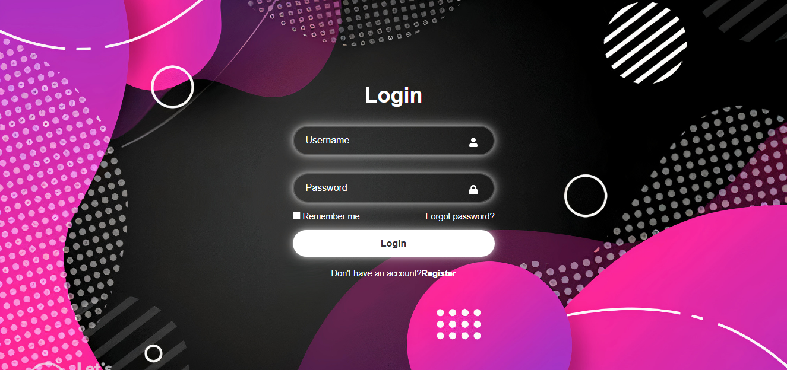
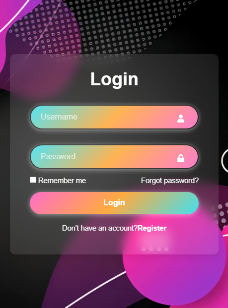
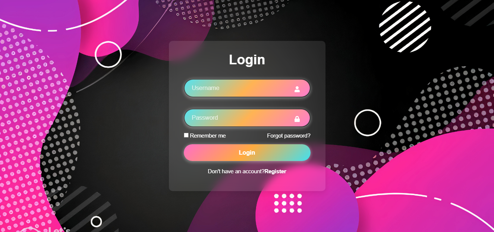

# My Login App

## Overview

This is my first React project, a stylish and modern login form built with React. The design incorporates a sleek, glassy effect with neon accents and a dynamic gradient for a visually appealing user interface.

## Features

- **Glassy UI**: The form has a semi-transparent, glass-like appearance with a subtle blur effect, giving it a modern and elegant look.
- **Neon Glow**: Inputs and buttons have a soft neon glow that enhances the user experience.
- **Gradient Effects**: The login button features a slanted gradient with three complementary colors that reverse on hover for an interactive effect.
- **Responsive Design**: The form is designed to be responsive and look great on different screen sizes.

## Preview

Here's a quick preview of the login form:

### Initial View

### Filled Input Fields

### Hover Effects

## Technologies Used

- **React**: The app is built using React, a popular JavaScript library for building user interfaces.
- **CSS3**: For styling, including the glassy effect, neon glow, and gradient transitions.
- **React Icons**: Used for adding icons to the input fields.

